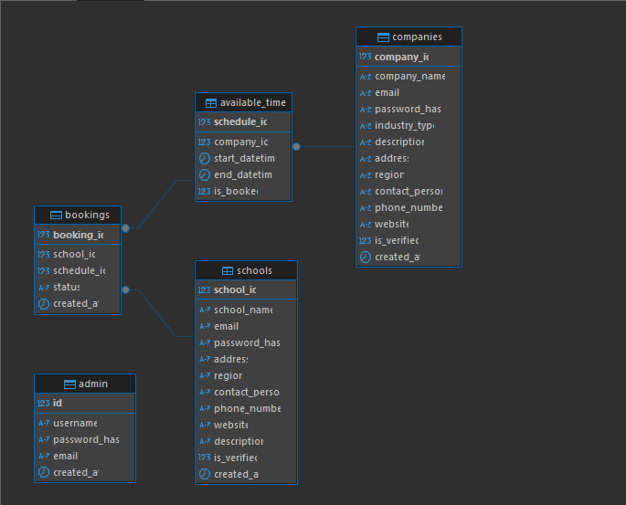

# Scheduler Database Documentation (SQLAlchemy ORM)

## Overview

This schema powers the **Scheduler System**, where:

* **Companies** create availability schedules.
* **Schools** register and book those slots.
* **Admins** manage accounts and verifications.

The schema is implemented with **SQLAlchemy ORM** and enforces **data integrity** using foreign keys, unique constraints, and checks.

---

## Database: `scheduler_db`

### 1. **Admins (`admins`)**

Stores platform administrators.

| Field           | Type         | Description                  |
| --------------- | ------------ | ---------------------------- |
| `id`            | INT (PK)     | Unique admin ID              |
| `first_name`    | VARCHAR(100) | First name                   |
| `middle_name`   | VARCHAR(100) | Optional middle name         |
| `last_name`     | VARCHAR(100) | Last name                    |
| `email`         | VARCHAR(100) | Unique email (indexed)       |
| `password_hash` | VARCHAR(255) | Hashed password              |
| `created_at`    | TIMESTAMP    | Auto set on creation         |
| `updated_at`    | TIMESTAMP    | Auto updated on modification |

---

### 2. **Schools (`schools`)**

Stores school accounts that book company slots.

| Field            | Type         | Description                      |
| ---------------- | ------------ | -------------------------------- |
| `school_id`      | INT (PK)     | Unique school ID                 |
| `school_name`    | VARCHAR(255) | School name (indexed)            |
| `email`          | VARCHAR(100) | Unique login email (indexed)     |
| `password_hash`  | VARCHAR(255) | Hashed password                  |
| `school_address` | VARCHAR(255) | Physical address                 |
| `region`         | VARCHAR(100) | Region (indexed)                 |
| `contact_person` | VARCHAR(100) | Full name of contact person      |
| `phone_number`   | VARCHAR(20)  | Phone number (indexed)           |
| `website`        | VARCHAR(100) | Optional website                 |
| `description`    | TEXT         | Notes / description              |
| `is_verified`    | BOOLEAN      | Verified flag (default: `FALSE`) |
| `created_at`     | TIMESTAMP    | Auto set on creation             |
| `updated_at`     | TIMESTAMP    | Auto updated on modification     |

🔗 **Relations:**

* A school can have **many bookings**.
* If a school is deleted → all its bookings are deleted (`ON DELETE CASCADE`).

---

### 3. **Companies (`companies`)**

Stores company accounts that create available schedules.

| Field            | Type         | Description                      |
| ---------------- | ------------ | -------------------------------- |
| `company_id`     | INT (PK)     | Unique company ID                |
| `company_name`   | VARCHAR(255) | Company name (indexed)           |
| `company_email`  | VARCHAR(100) | Unique login email (indexed)     |
| `password_hash`  | VARCHAR(255) | Hashed password                  |
| `industry_type`  | VARCHAR(100) | Industry type (indexed)          |
| `contact_person` | VARCHAR(100) | Full name of contact person      |
| `phone_number`   | VARCHAR(20)  | Phone number (indexed)           |
| `website`        | VARCHAR(100) | Optional website                 |
| `description`    | TEXT         | Company description              |
| `is_verified`    | BOOLEAN      | Verified flag (default: `FALSE`) |
| `created_at`     | TIMESTAMP    | Auto set on creation             |
| `updated_at`     | TIMESTAMP    | Auto updated on modification     |

🔗 **Relations:**

* A company can have **many available time slots**.
* If a company is deleted → all its slots are deleted (`ON DELETE CASCADE`).

---

### 4. **Available Time Slots (`available_times`)**

Stores company schedules available for schools to book.

| Field         | Type      | Description                       |
| ------------- | --------- | --------------------------------- |
| `schedule_id` | INT (PK)  | Unique schedule ID                |
| `company_id`  | INT (FK)  | References `companies.company_id` |
| `start_date`  | DATETIME  | Schedule start date/time          |
| `end_date`    | DATETIME  | Schedule end date/time            |
| `created_at`  | TIMESTAMP | Auto set on creation              |
| `updated_at`  | TIMESTAMP | Auto updated on modification      |

🔐 **Constraints:**

* `end_date > start_date` enforced (`CheckConstraint`).

🔗 **Relations:**

* A schedule can have **many bookings**.
* If a schedule is deleted → related bookings are deleted (`ON DELETE CASCADE`).

---

### 5. **Bookings (`bookings`)**

Stores reservations made by schools.

| Field         | Type      | Description                              |
| ------------- | --------- | ---------------------------------------- |
| `booking_id`  | INT (PK)  | Unique booking ID                        |
| `schedule_id` | INT (FK)  | References `available_times.schedule_id` |
| `school_id`   | INT (FK)  | References `schools.school_id`           |
| `status`      | ENUM      | `pending`, `confirmed`, `cancelled`      |
| `created_at`  | TIMESTAMP | Auto set on creation                     |
| `updated_at`  | TIMESTAMP | Auto updated on modification             |

🔐 **Constraints:**

* A school cannot book the same schedule twice (`UniqueConstraint(schedule_id, school_id)`).

---

## 🔗 Relationships Summary

* **Admin** → manages accounts and verifications.
* **Company** → creates `available_times`.
* **School** → books company schedules.
* **AvailableTime** → belongs to a company, may have many bookings.
* **Booking** → links a school to a specific time slot.

---

## ERD (Entity Relationship Diagram)

---